#  <strong>实验室GPU服务器的LXD虚拟化 <strong>
实验室加了台GPU服务器用于深度学习，因为实验室人数比较多，但是每个人使用的软件千差万别，多人使用同一台的话，软件，环境，文件，配置杂七杂八。甚至还有小白会运行损害系统的命令  
  
所以我们做了虚拟化。为什么使用LXD呢，而不是使用最热门的docker呢？  
两者都是基于lxc虚拟化,而docker作为应用容器，LXD是系统容器（可以安装完整的桌面有没有很赞），更加接近我们的生产环境，想象一下，别人使用docker时，还要自己使用命令上传文件，运行程序。尤其是小白对着黑框框会很头疼。而自己打开远程，打开pycharm，美滋滋。去除什么linux不要用桌面的想法，9102年了，ubuntu桌面已经很稳定了。接下来就来安装使用吧

> ## 第一步：宿主机的安装与配置
>> ### 服务器系统的安装  
>>> 建议安装server版，通过ssh远程 [ubuntu镜像](http://cdimage.ubuntu.com/releases/18.04/release/ "image")  
>>> 服务器一般有一块SSD和多块机械做成的RAID的阵列，系统安装在SSD（比较小）还有一块RAID阵列的数据盘  
>>### 服务器显卡驱动的安装  
>>>(如不能访问，在pdf文件夹已经离线好)  
>>> [显卡驱动安装](https://medium.com/@cjanze/how-to-install-tensorflow-with-gpu-support-on-ubuntu-18-04-lts-with-cuda-10-nvidia-gpu-312a693744b5 "linux显卡驱动安装"),  
>>>安装NVIDIA显卡驱动、CUDA、cuDNN


> ## 第二步：lxd的安装与初始化
>>### 安装lxd 
>>> LXD 实现虚拟容器  
>>> ZFS 用于管理物理磁盘，支持LXD高级功能  
>>> bridge-utils 用于搭建网桥  
>>>#### 安装LXD、ZFS和bridge-utils  
>>>>`sudo apt-get install lxd zfsutils-linux bridge-utils`
>>### 配置网桥:
>>>因为学校信息中心网络的限制，如果配置桥接网卡，会导致流量异常，直接断网，因此实现每人一个ip的方式失败，不得已我们采用端口监听的方式来实现各个容器的连接(如果你不想使用监听的方式请自行上网查询LXD配置桥接网卡)
>>### 配置ZFS
>>>首先，我们运行sudo fdisk -l列出服务器上的可用磁盘和分区，我们有两块硬盘，第一块为系统盘，第二块为数据盘，现在我们将数据盘（/dev/sdb）分出需要使用的空间，作为容器的存储卷。  
>>>### 查看分区
>>>>`sudo fdisk /dev/sdb`  
>>>
>>>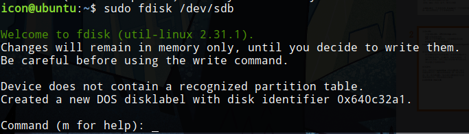  
>>>按照下图分出了80GB的分区作为容器的存储卷，分区为/dev/sdb1，剩下的空间同理可以分区，可以作为服务器另外的应用使用  
>>>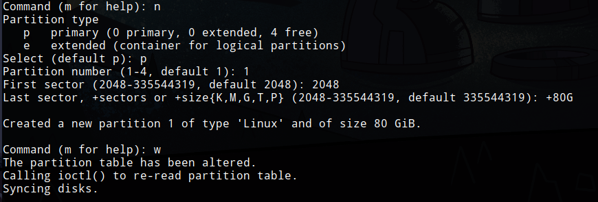  
>>### 创建块设备  
>>>#### 在块设备 /dev/sdb1 上创建一个ZFS存储池  
>>>>`sudo lxc storage create zfs-pool zfs source=/dev/sdb1`  
>>### LXD初始化  
>>>>`sudo lxd init` 
>>>  
>>>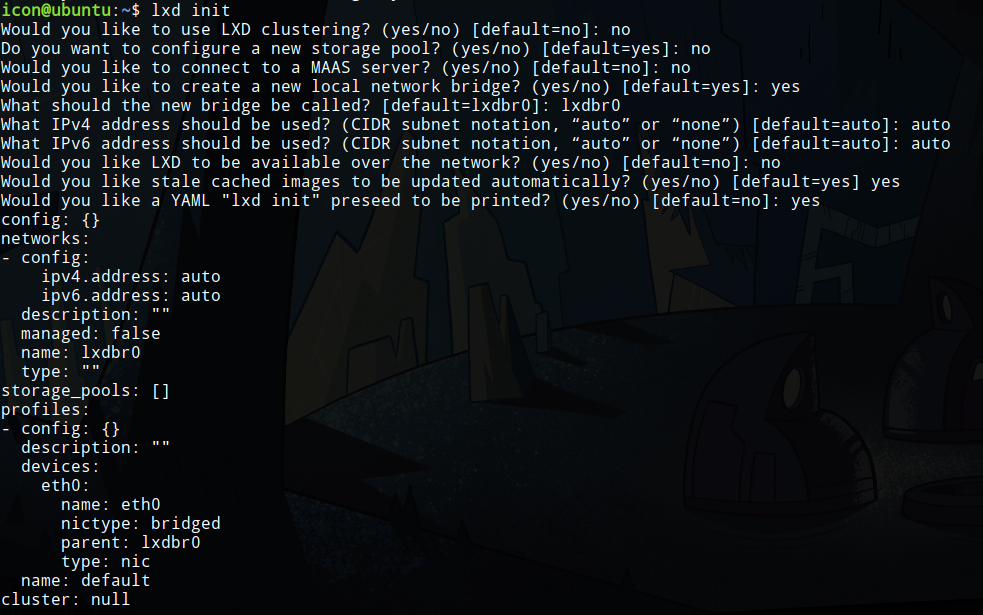  
>>>因为我们已经创建好了一个叫zfs-pool的存储池，所以在lxd初始化时不需要创建新的储存池，之后在进行配置即可  
>>>### 再次配置
>>>>`sudo lxc profile edit default`  
>>>### 修改容器内默认磁盘大小
>>>在配置时还将每个容器的硬盘大小限制为固定大小  
>>>（如果没有设置，容器里面的磁盘大小为整个储存池的大小）  
>>>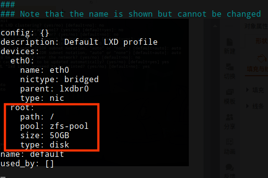  

># 第三步：容器的创建  
>>## 加速源  
>>>### 使用清华的镜像源（加速创建）  
>>>>`sudo lxc remote add tuna-images https://mirrors.tuna.tsinghua.edu.cn/lxc-images/ --protocol=simplestreams --public`  
>>>### 列出可用的镜像  
>>>>`sudo lxc image list tuna-images: ` 
>>## 创建ubuntu容器  
>>>### 使用清华源中的ubuntu镜像创建一个叫test的容器  
>>>>`sudo lxc launch tuna-images:ubuntu/18.04 test`  
>>## 进入容器  
>>>`sudo lxc exec test bash`  
>>>
>>>我们登录的是root用户，在这个容器中已经存在了一个叫ubuntu的用户  
>>## 修改密码  
>>>`passwd root`  
>>>`passwd ubuntu`   
>>>
>>>容器里的ubuntu是一个很精简的系统，需要安装各种软件  
>>## 安装ssh  
>>>`apt install ssh`  
>>## 通过ssh连接容器 
>>>### 查看容器与宿主机的ip  
>>>>因为我们没有设置桥接网卡，不能从外部电脑访问容器（不能ping通容器的ip），因此我们采用端口监听的方式来访问我们的容器。
>>>>#### 退出容器  
>>>>>`exit`  
>>>>#### 在宿主机查看容器  
>>>>>`sudo lxc list`  
>>>>#### 图中可知容器的ip地址为10.152.210.183  
>>>>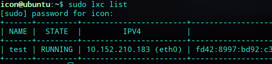  
>>>>#### 查看宿主机ip地址
>>>>>`ip addr`  
>>>>#### 可知宿主机ip为172.22.24.126  
>>>## 端口转发  
>>>>`sudo lxc config device add test proxy0 proxy listen=tcp:172.22.24.126:60601 connect=tcp:10.152.210.183:22 bind=host`  
>>>
>>>>60601是我们定的端口号，通过宿主机的60601端口号监听容器中22端口号（SSH默认端口号）
 
># 第四步：初始容器的配置  
>>## 使用ssh连接容器并配置  
>>>`ssh ubuntu@172.22.24.126 -p 60601`
>>## 1. 更换源  
>>>### 备份原来的源  
>>>>`sudo mv /etc/apt/sources.list  /etc/apt/sources.list.bak`  
>>>### 编辑写入网易源  （中国源）
>>>### （注意系统版本 ubuntu 18.04 bionic）  
>>>>`sudo vim /etc/apt/sources.list`  
>>>```
>>>deb http://mirrors.163.com/ubuntu/ bionic main restricted universe multiverse
>>>deb-src http://mirrors.163.com/ubuntu/ bionic main restricted universe multiverse
>>>deb http://mirrors.163.com/ubuntu/ bionic-security main restricted universe multiverse
>>>deb-src http://mirrors.163.com/ubuntu/ bionic-security main restricted universe multiverse
>>>deb http://mirrors.163.com/ubuntu/ bionic-updates main restricted universe multiverse
>>>deb-src http://mirrors.163.com/ubuntu/ bionic-updates main restricted universe multiverse
>>>deb http://mirrors.163.com/ubuntu/ bionic-proposed main restricted universe multiverse
>>>deb-src http://mirrors.163.com/ubuntu/ bionic-proposed main restricted universe multiverse
>>>deb http://mirrors.163.com/ubuntu/ bionic-backports main restricted universe multiverse
>>>deb-src http://mirrors.163.com/ubuntu/ bionic-backports main restricted universe multiverse
>>>```  
>>## 2. 为容器添加显卡  
>>>我们回到宿主机  
>>>### 为容器添加所有GPU:  
>>>>`lxc config device add yourContainerName gpu gpu`  
>>>### 添加指定GPU：  
>>>>`lxc config device add yourContainerName gpu0 gpu id=0`  
>>>## 安装驱动 
>>>添加好显卡后，就相当于我们给容器安装了显卡，我们回到容器，然后安装显卡驱动    
>>>与宿主机的显卡版本必须一致，安装方法参考第一步NVIDIA显卡驱动、CUDN、cuDNN的安装  
>>>需要注意的是容器里面安装显卡驱动时需要加上后面的参数，安装时不需要安装到内核  
>>>>`sudo sh ./NVIDIA-Linux-X86_64-[YOURVERSION].run --no-kernel-module`  
>>>### 到了这一步可以看第七步：容器模板，将server版的容器导出为镜像，可供不需要桌面的同学使用（推荐可以使用VSCode安装Remote SSH插件连接远程服务器）
>>## 3. 安装图形化界面  
>>>### 刷新源
>>>>`sudo apt update`  
>>>### 安装无推荐软件的ubuntu桌面(默认安装gnome，完整安装会有很多无关的软件)
>>>>`sudo apt install --no-install-recommends ubuntu-desktop`
>>## 4.安装远程连接  
>>>### 使用安装脚本（安装git后下载我们之后需要用的东西）    
>>>>`sudo apt install git`   
>>>>`git clone https://github.com/shenuiuin/LXD_GPU_SERVER`    
>>>### 打开文件夹    
>>>>`cd LXD_GPU_SERVER/`    
>>>### 赋予脚本可执行权限    
>>>>`sudo chmod a+x xrdp-installer-1.2.sh`   
>>>### 脚本会下载一些文件，需要有Downloads文件夹    
>>>>`mkdir -p ~/Downloads`    
>>>###  安装脚本  
>>>>`./xrdp-installer-1.2.sh -c -l -s`    
>>>### 安装完成    
>>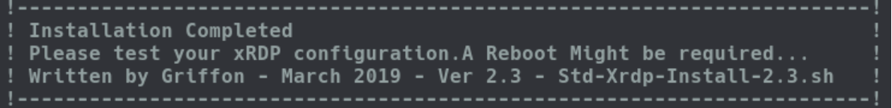  
>>>### [脚本源地址](http://c-nergy.be/blog/?cat=79 "xrdp.sh")  
>>>### 如果有其他桌面的需求
>>> [kde桌面环境以及xrdp安装](https://www.hiroom2.com/2018/05/07/ubuntu-1804-xrdp-kde-en/ "kde")   
>>> [xfce桌面环境以及xrdp安装](https://www.hiroom2.com/2018/05/07/ubuntu-1804-xrdp-xfce-en/ "xfce")   
>>> [xrdp解决声音重定向](http://c-nergy.be/blog/?p=12469 "redirect Sound") 
>>## 5. 远程连接测试  
>>>### 端口转发   
>>>在安装好XRDP后，与之前一样，因为我们ping不通容器，所以我们需要使用宿主机的端口号监听容器的xrdp的端口 
>>>>`sudo lxc config device add test proxy1 proxy listen=tcp:172.22.24.126:60611 connect=tcp:10.152.210.183:3389 bind=host`  
>>>### 远程连接  
>>>>60611是我们定的端口号，通过宿主机的60611端口号监听容器中3389端口号（XRDP默认端口号）  
>>>可以通过windows的远程连接来使用容器(windows运行mstsc)  
>>>>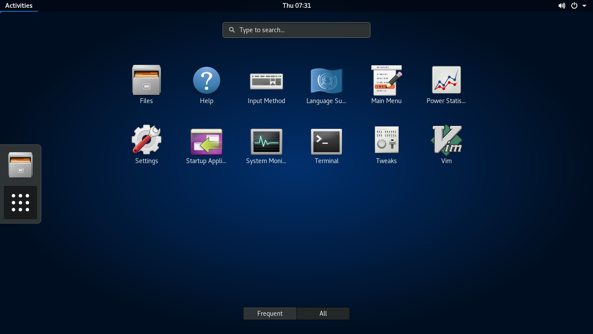  
>>>>接下来就是当普通的ubuntu来使用，比如可以找一些教程：安装完ubuntu必做的事等等  


># 第五步：ubuntu的美化等配置  
>>## icon图标主题  
>>>`sudo apt update`  
>>>`sudo apt install papirus-icon-theme`  
>>## GTK主题  
>>>`git clone https://github.com/vinceliuice/vimix-gtk-themes`  
>>>`cd vimix-gtk-themes`  
>>>`sudo ./vimix-installer`  
>>## 应用主题  
>>>主题安装好后用使用gnome-tweak-toos来应用主题  
>>>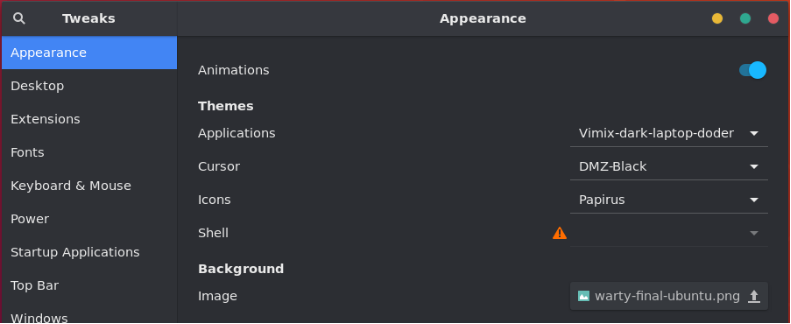   
>>>还可以个性化你的ubuntu，比如加上最大化最小化按钮  
>>>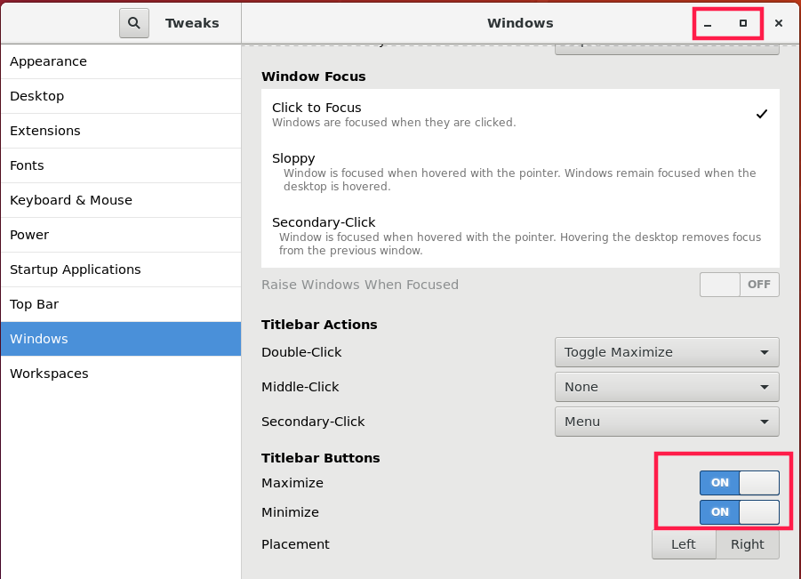  
>>## gnome扩展  
>>>推荐的这些扩展   
>>>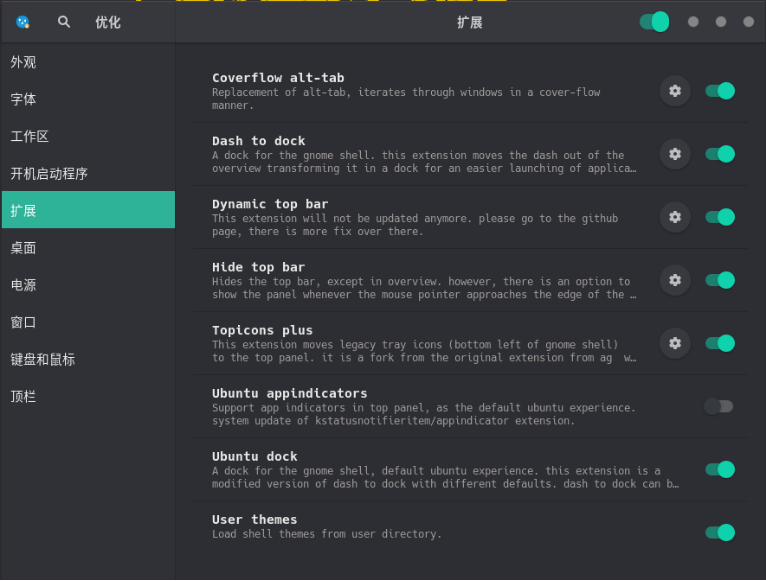   
>>## 切换中文  
>>>系统的中文在Language Support。然后添加简体中文的语言将中文拖到第一项，然后应用到整个系统  
>>>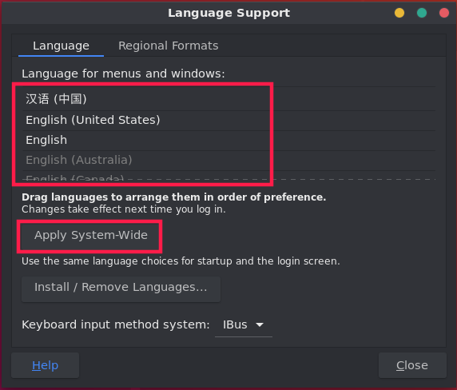  
>>## 保留旧的名称
>>>重启之后会有提示将文件夹的名字改成中文（最好还是用旧的名称，英文路径）  
>>>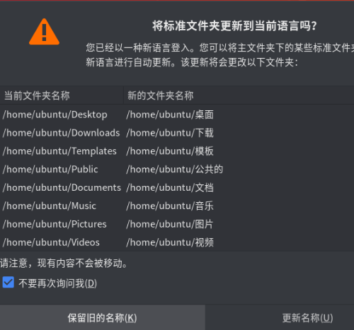  
>>## 安装需要的软件  
>>>### 搜狗输入法、谷歌浏览器等等  
>>>### 显示Linux系统信息  
>>>>`sudo apt install neofetch`  
>>>>`neofetch`
>>>### 查看CPU运行以及内存占用情况   
>>>>`sudo apt install htop`  
>>>>`htop` 
>>>### 查看显卡运行情况  
>>>>`nvidia-smi`  
>>>### 实时查看显卡运行情况(按照0.1s的频率实时刷新)  
>>>>`watch -n0.1 nvidia-smi`  

># 第六步：容器管理  
>>>### 查看zfs储存卷的占用情况
>>>`zpool list`  
>>## 为容器修改参数配置  
>>>我们不想每个人使用全部的硬件资源，所以还需要限制每个人的参数  
>>[容器参数配置说明](https://linuxcontainers.org/lxd/docs/master/containers "Container configuration")  
>>>### 配置容器参数
>>>> `lxc config edit YourContainerName`   
>>>###  一般使用以下的配置即可满足
>>>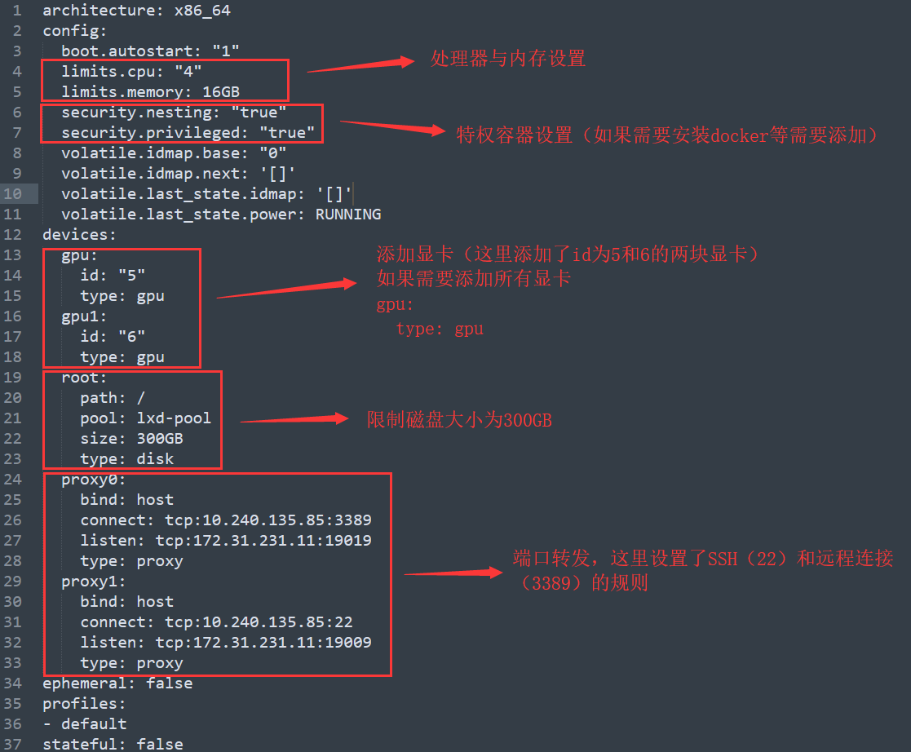 
>>>其实在教程第二步的最后编辑默认磁盘大小的时候就已经在操作了（default）
>>> ### 配置默认容器参数（新容器的参数会继承default配置的参数，容器会优先使用自己的参数）  
>>>> `sudo lxc profile edit default`  
>>## 管理员须知  
>>>管理员应在桌面上新建使用说明read.txt，写下系统的版本等信息、安装了什么软件、各种注意事项等等  

># 第七步：容器模板  
>>我们把这个配置好的容器当成模板，保存为镜像。  
>>>## 停止容器  
>>>>`sudo lxc stop test`  
>>>## 将test容器保存为ubuntudemo镜像  
>>>>`sudo lxc publish test --alias ubuntudemo --public`  
>>## 从模板镜像中新建容器
>>以后直接用模板镜像来创建容器，容器创建好后为它添加端口映射（远程连接与SSH）  
>>还要为它添加显卡（显卡驱动已经有了）并配置它的硬件参数，(可使用默认配置文件，使得新容器的参数继承于它，这一步就可以省略)
>>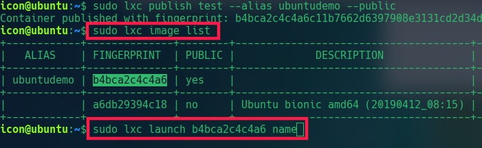 
# [成果展示（双屏~声音）](https://www.bilibili.com/video/av61400281 "哔哩哔哩") 
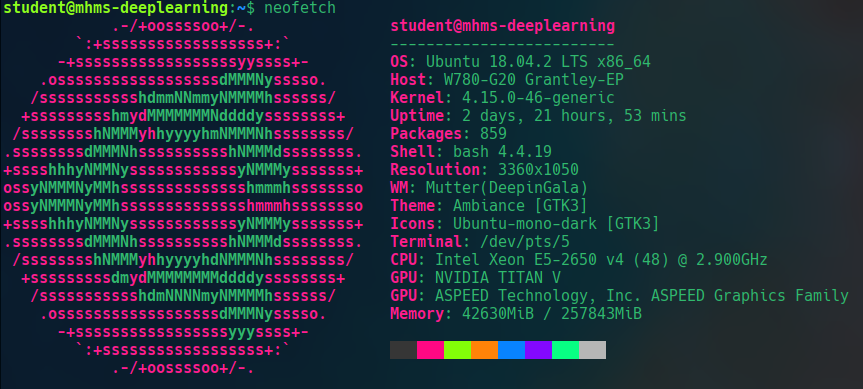 
 
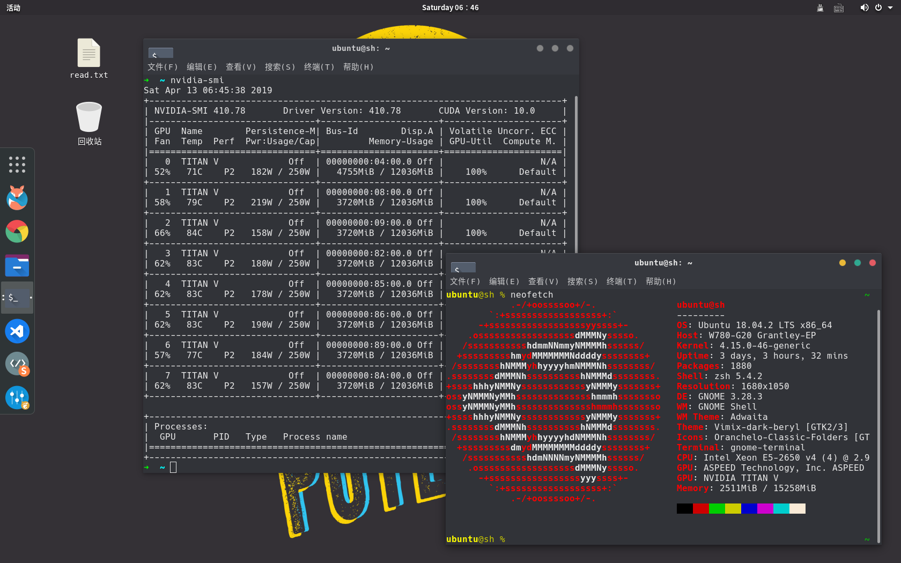 

># 番外
>## 在lxd容器中使用docker  
>>>`lxc config edit YourContainerName`  
>>### 在config中添加  
>>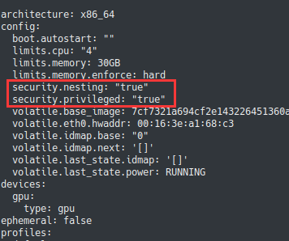  
>>### 然后重启容器  
>>>`lxc restart YourContainerName`  
>>## [安装docker](https://docs.docker.com/install/linux/docker-ce/ubuntu/ "docker") 
>## 共享目录
>>### path1为宿主机路径，path2为容器内路径。
>>>`lxc config set yourContainerName security.privileged true`  
>>>`lxc config device add privilegedContainerName shareName disk source=path1 path=path2`  
>>### 若容器内沒有对共享目录沒有权限，只需将宿主机目录路径权限给足  
>>>`sudo chmod -R 777 path1`
>## 使用自定义lxd容器  
>>### 上述lxd容器只能使用镜像源中，但如果我们想使用自己喜欢的发行版，或者自己已经有一台各方面已经调教满意的linux实体机，不想折腾了。这时候我们便可以将此系统移植到lxd中
>>### 接下来我以manjaro为例演示
>>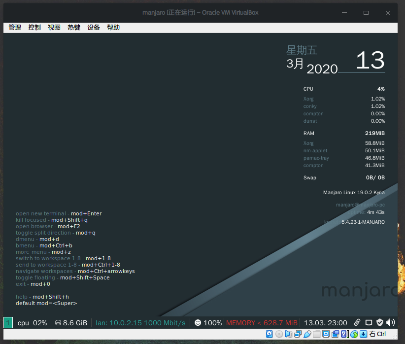 
>>### [首先为manjaro安装远程——XRDP](https://qiita.com/hisadg/items/cf58d3f4e3ededcffca4 "manjaro安装XRDP") 
>>### 启用aur,安装xrdp、xorgxrdp
>>>`yay -S xrdp xorgxrdp`  
>>### 创建以下配置文件 `/etc/X11/Xwrapper.config`
>>>`allowed_users=anybody`  
>>>`needs_root_rights=auto`
>>### 修改pam.d `/etc/pam.d/xrdp-sesman`
>>>`auth      include   system-remote-login`  
>>>`account   include   system-remote-login`  
>>>`password  include   system-remote-login`  
>>>`session   include   system-remote-login`  
>>### 修改 `~/.xinitrc`
>>>找到这行  
>>>`local dbus_args=(--sh-syntax --e10.240.135.158xit-with-session)`  
>>>改为  
>>>`local dbus_args=(--sh-syntax)` 
>>### 启动服务与添加开机自启
>>>`sudo systemctl enable xrdp`  
>>>`sudo systemctl enable xrdp-sesman`  
>>>`sudo systemctl start xrdp`  
>>>`sudo systemctl start xrdp-sesman`  
>>### 测试远程连接，虚拟机可能需要桥接网卡才能访问
>>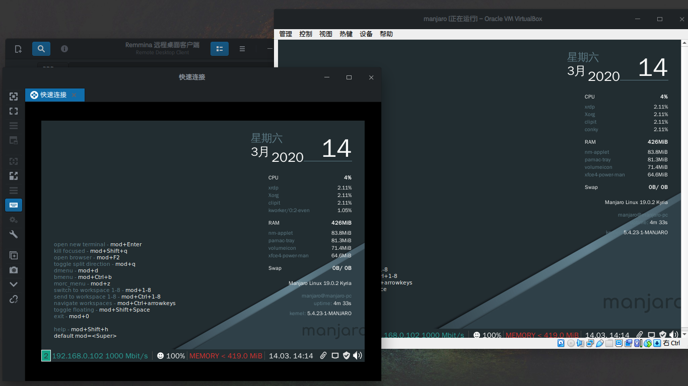 
>>### 准备一个linux live cd,可以使用ubuntu、manjaro等，实体机需要制作启动盘，使用rufus刻录即可
>>### 实体机U盘启动，虚拟机直接挂载镜像
>>### 查看分区
>>>`sudo fdisk -l`  
>>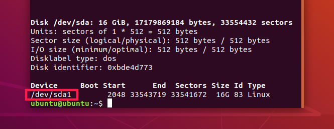 
>>### 这里`/dev/sda1`分区是安装的系统的根目录，我们将他挂载出来
>>### 如果还有其他的挂载点也需要挂载到/data1的相应目录，保证系统文件的完整性
>>>`sudo mkdir /data1`  
>>>`sudo mount /dev/sda1 /data1`    
>>### 这里`/dev/sdb`是我新加的一块硬盘，作为打包文件存放的地方，现在格式化并挂载，实体机可以直接挂载其他分区作为存放的地方
>>>`sudo mkfs -t ext4 /dev/sdb`  
>>>`sudo mkdir /data2`  
>>>`sudo mount /dev/sdb /data2`  
>>### 打包系统文件到/data2目录
>>>`cd /data2`  
>>>`sudo tar -cvzf rootfs.tar.gz -C /data1 .`  
>>### 创建metadata.yaml文件，根据自己的需要修改
>>>`architecture: "x86_64"`  
>>>`creation_date: 1584170077 # To get current date in Unix time, use `date +%s` command`  
>>>`properties:`  
>>>`architecture: "x86_64"`  
>>>`description: "manjaro_i3wm_xrdp"`  
>>>`os: "manjarolinux"`  
>>>`release: "kyina"`  
>>### 打包metadata.yaml文件
>>>`tar -cvzf metadata.tar.gz metadata.yaml`
>>### 将这两个文件上传到服务器的同一个文件夹
>>### 现在我们连接到服务器，切换到那两个文件的目录
>>### 导入镜像
>>>`lxc image import metadata.tar.gz rootfs.tar.gz --alias manjaro_demo`
>>### 接下来便可以当做正常的镜像使用
>>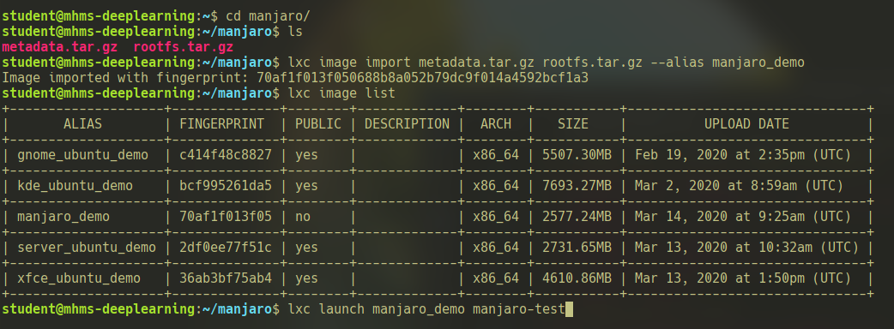 
>>### 在lxd-3.0.3版本中的arch系容器不能自动获取ipv4，可以安装更高版本的lxd(使用snap安装)，或者每次重启容器时进容器手动获取
>>>`lxc exec manjaro-test bash`  
>>>`ip a`  
>>>`ip link set eth0 up`  
>>>`dhcpcd eth0`  
>>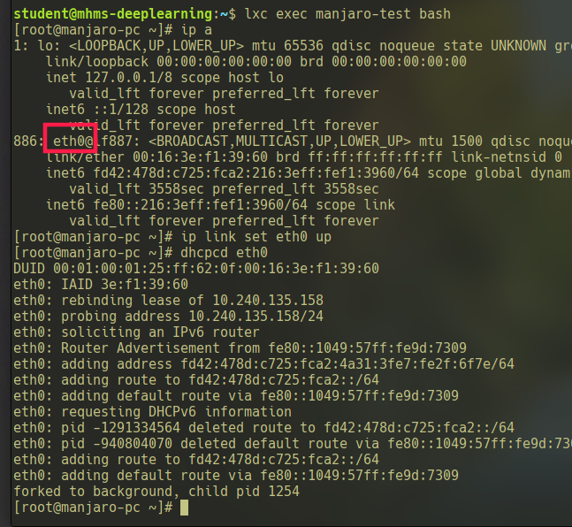 
>>### 接下来就是为新容器添加显卡，并配置它的硬件参数，安装与宿主机一样版本的NVIDIA、CUDA、cuDNN驱动(可能会遇到gcc版本问题，降级即可)
>>### 目前测试成功的有manjaro、deepin（deepin直接安装xrdp）
>>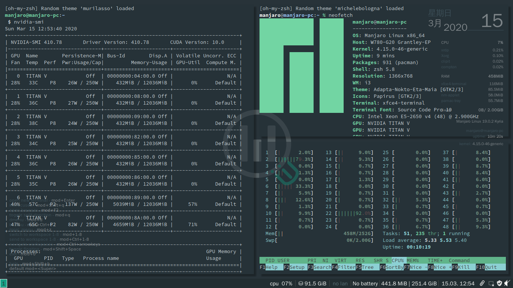 
>>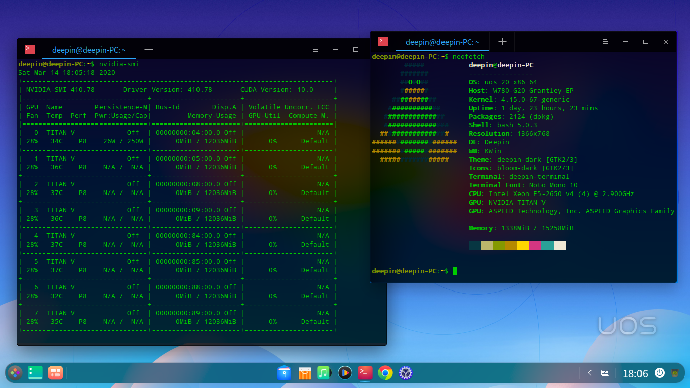 
