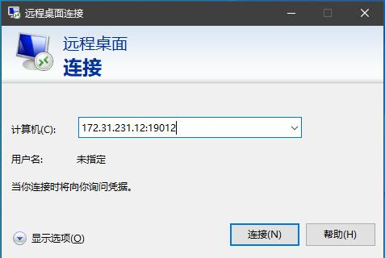
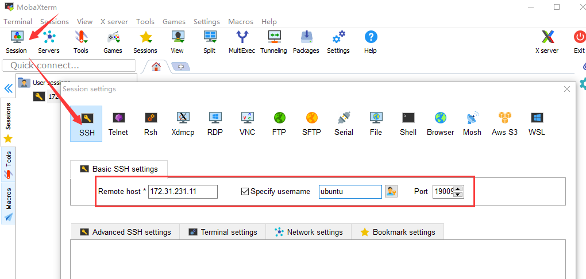
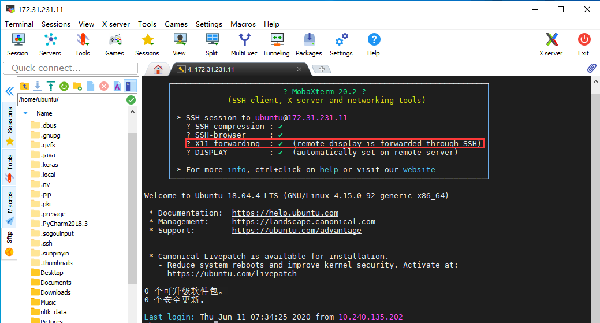
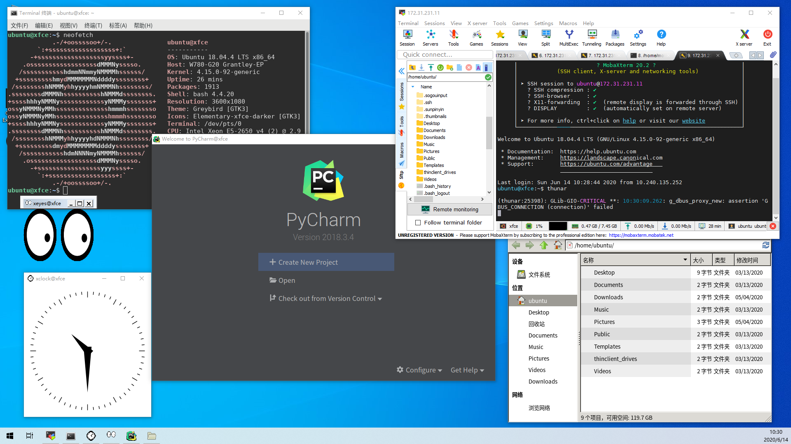
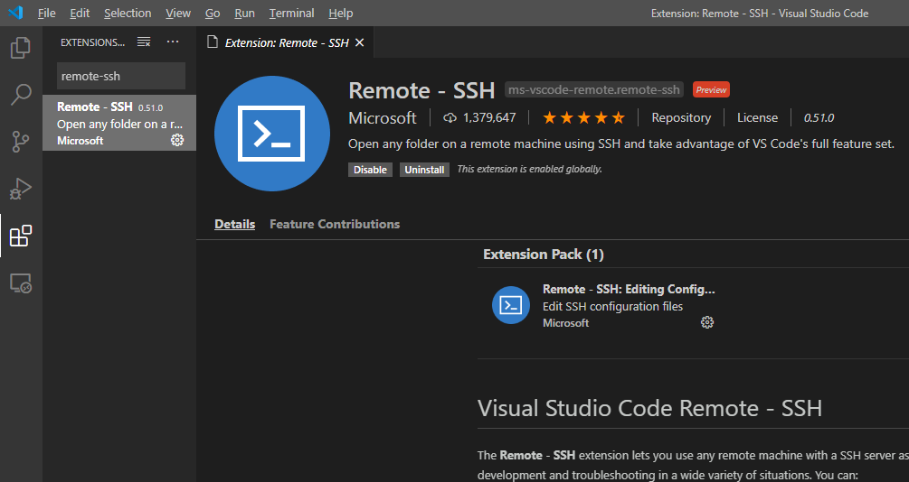
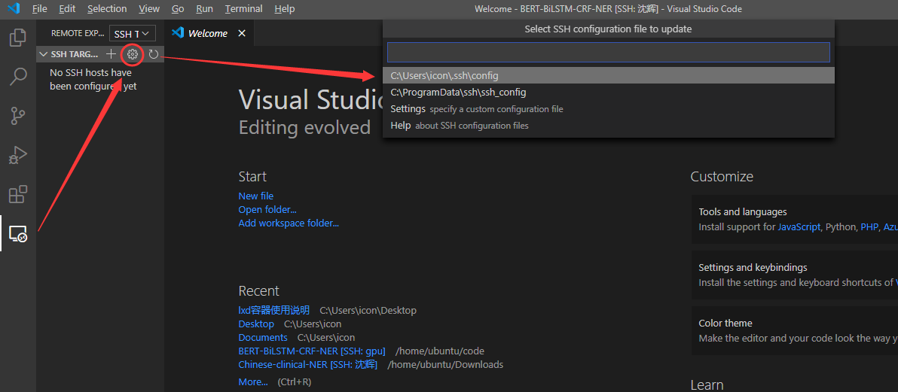
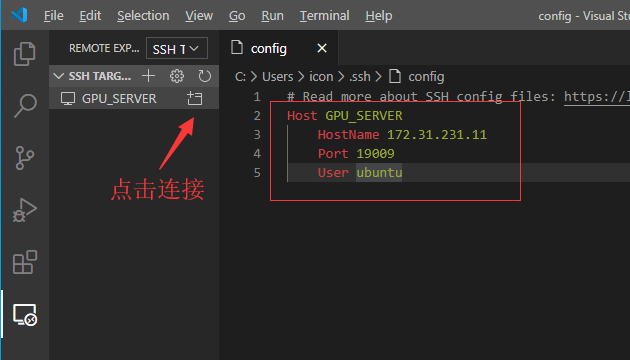
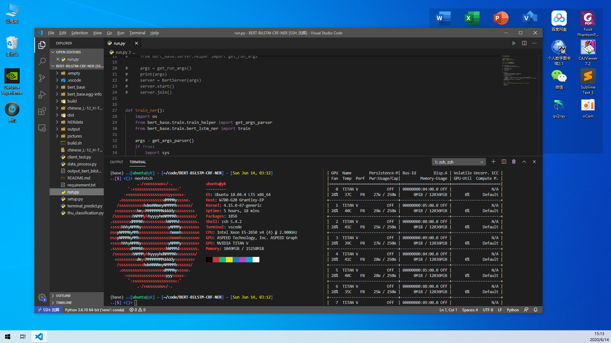

># 现在有三种方式进行连接 
（在使用ssh连接时，推荐学习一下screen命令，将运行的程序挂到后台）
>## （一）使用windows远程连接
>>#### 如果你使用其他的系统请安装支持rdp协议的软件，linux可安装remmina，mac可安装Microsoft Remote Desktop  （如果自己电脑为高分辨率的屏幕，请自行调节远程系统的缩放，不然字会非常小）
>>#  
>>#### 优点：完整的linux桌面体验
>>#### 缺点：当网络环境不良时操作延时特别大、桌面长时间运行时会卡死（一般gnome桌面会出现，推荐使用xfce桌面）
>## （二）使用X11-forwarding转发单个应用的图形界面
>>#### 使用MobaXterm软件SSH连接服务器
>>#  
>>#### SSH连接
>>#  
>>#### 在终端直接输入执行软件命令
>>#### 例如执行 `/opt/pycharm-2018.3.4/bin/pycharm.sh` 启动pycharm
>>#  
>>#### 优点：只转发单个应用的图形界面，与桌面环境无关
>>#### 缺点：暂时不能输入中文（应该有解决方法，还没有去找）
>## （三）使用vscode的remote-ssh插件远程连接
>>#### 安装vscode，然后安装Remote-ssh插件
>>#  
>>#### 修改连接配置文件
>>#  
>>#### 添加服务器地址、连接端口（SSH）、用户名，保存后连接
>>#  
>>#### 打开远程服务器工程，
>>#  
>>#### 优点：实时同步、延时小、文件可直接拖曳到工程里
>>#### 缺点：`plot`画图时图片不能跳转，现解决办法为使用`plot.savefig`保存图片后查看，或使用后缀为ipynb的文件写代码（jupyter）
 