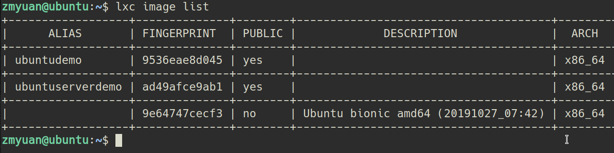
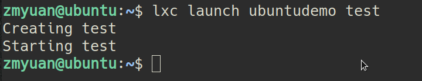
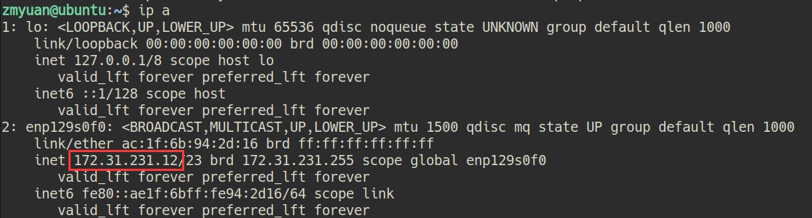
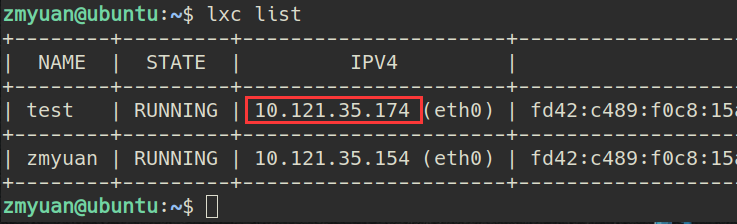
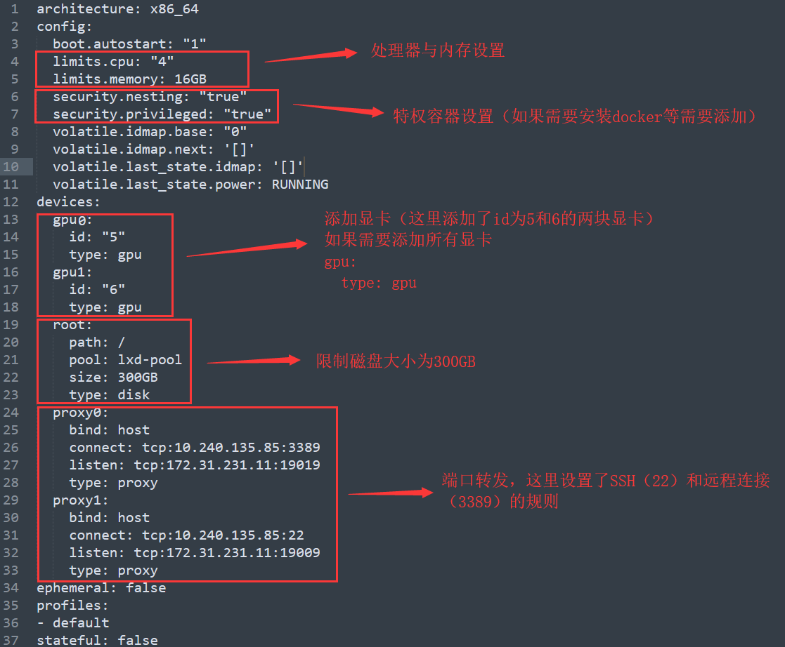

li#  <strong>实验室GPU服务器的LXD虚拟化使用说明 <strong>
># 第一步：查看已有的镜像
>>>`lxc image list`
>># 
>>## 其中ubuntudemo为之前打包好的安装了桌面的容器镜像
># 第二步：从已有的镜像中创建新容器
>>>`lxc launch ubuntudemo YourContainerName`
>>#  
>>>#### 新容器内默认已创建好普通用户，一般用户名和密码都为此容器系统发行版的名称，如：
>>>`用户名：ubuntu      密码：ubuntu`  
># 第三步：为新容器添加端口监听
>>### 查看宿主机IP  
>>>`ip a`
>>#  
>>### 查看容器IP  
>>>`lxc list`
>>#  
>>### 我们规定，19届学生使用宿主机1900x的端口来监听容器的22端口（SSH连接端口），使用宿主机1901x的端口用来监听容器的3389端口（远程连接端口），以此类推   
>>>`lxc config device add YourContainerName proxy0 proxy listen=tcp:172.31.231.12:19012 connect=tcp:10.121.35.174:3389 bind=host`  
>>>`lxc config device add YourContainerName proxy1 proxy listen=tcp:172.31.231.12:19002 connect=tcp:10.121.35.174:22 bind=host`   
># 第四步：为新容器配置硬件参数(上一步的端口监听也可在此编辑)
>>> `lxc config edit YourContainerName`   
>>###  一般使用以下的配置即可满足(一般编辑器为nano或vim，推荐将容器关闭后编辑)
>> 
>> ### 或者配置默认容器参数（新容器的参数会继承default配置的参数，容器会优先使用自己的参数）  
>>> `sudo lxc profile edit default`  
># 删除容器
>>`lxc stop yourContainerName`  
>>`lxc rm yourContainerName`  

>## 在lxd容器中使用docker  
>### 设置容器为特权模式
>>`lxc config set yourContainerName security.nesting true`  
>>`lxc config set yourContainerName security.privileged true`  
>### 然后重启容器  
>>`lxc restart YourContainerName`  
>### [在容器内安装docker](https://docs.docker.com/install/linux/docker-ce/ubuntu/ "docker") 

>## 在lxd容器中使用matlab
>## 将安装有matlab的容器的cpu限制去除（直接设置全部核），不然运行代码会报错

>## 共享目录
>path1为宿主机路径，path2为容器内路径。
>>`lxc config set yourContainerName security.privileged true`  
>>`lxc config device add privilegedContainerName shareName disk source=path1 path=path2` 
>### 若容器内对共享目录沒有权限，只需将宿主机目录路径权限给足  
>>`sudo chmod -R 777 path1`